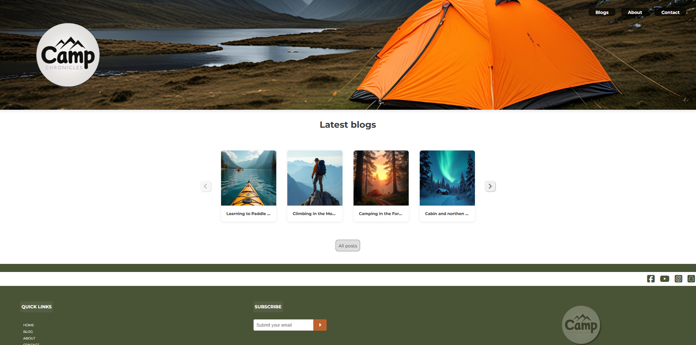

# Project Exam 1
Camp Chronicles




A personal blog created for sharing camping stories, tips and experiences related to camping and outdoor adventures. This was an project exam to show skills in using HTML, CSS and JAVASCRIPT. 

## Description

Camp Chronicles is a blog where users can read and explore different camping trips and topics. The blog have a user-friendly layout and a responsive design, giving the user a nice browsing experince on both desktop and mobile. 

### Features:
- Responsive design for different screen sizes
- Dynamic blog posts, where javaScript is used to dynamically display content for users
- Contact form with feedback
  

## Built With

You can list a the tech stack that you've used over here

# Camp Chronicles

A blog created as a project exam, showcasing posts and features related to camping, outdoor activities, and personal experiences.

## Built With

- [HTML5](https://developer.mozilla.org/en-US/docs/Web/HTML) - Used for structuring the content of the blog.
- [CSS3](https://developer.mozilla.org/en-US/docs/Web/CSS) - Used for styling and layout design.
- [JavaScript](https://developer.mozilla.org/en-US/docs/Web/JavaScript) - Used to add functionality, such as dynamic blog posts


## Getting Started

### Installing

To run locally, follow following steps:

1. Clone the repo:

```
git clone https://github.com/evrlong/project-exam1-evrlong.git
```

3. Navigate to folder:

```
cd project-exam1-evrlong.git
```

### Running

To open project:
- navigate to clone folder
- open index.html in your web browser

## Contributing

If you want to contribute, you can make som changes or add new features and submit a pull request for review.

## Contact

If you want to get in touch you can reach me at:

[www.linkedin.com/in/erik-løkken-005384261](www.linkedin.com)


## Acknowledgments

I like to aknowledge to everyone who have taken the time to provide feedbacks during the project. 
